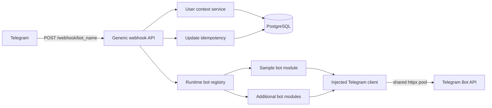
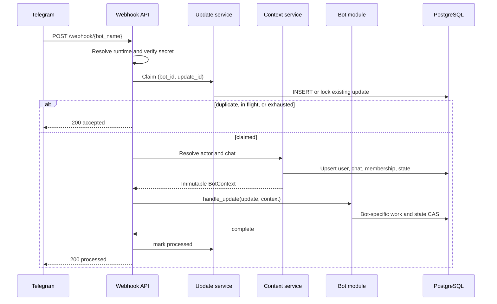

# Telegram Bot Platform

A FastAPI modular monolith that hosts multiple independently developed Telegram
bots in one process. The platform discovers bot modules, loads encrypted runtime
configuration from PostgreSQL, registers Telegram identities automatically, and
keeps update and conversation state isolated by bot.

The project targets Python 3.13 and uses FastAPI, SQLAlchemy 2 async, asyncpg,
Alembic, Pydantic v2, httpx, structlog, `uv`, PostgreSQL, and Docker Compose.

## Workspace locations

This document describes the backend located in `backend/`. Run backend-local
commands from this directory. The single authoritative local environment file is
`../.env`; backend Make targets explicitly export it before running Uvicorn or
Alembic. The Compose stack remains at repository root, so run `docker compose`
there (or use the backend Make targets, which pass `-f ../docker-compose.yml`).

For a direct `uv run` command instead of a Make target, explicitly load the same
root environment in that shell first:

```bash
set -a; . ../.env; set +a
uv run alembic current
```

Copy the root example once when setting up a workspace:

```bash
cp .env.example .env
cd backend
```

## Architecture

This is one deployable application and one database, not a collection of
microservices. Modules have explicit boundaries but share platform infrastructure
and transactions.



The platform owns:

- Database, HTTP, logging, request IDs, configuration, and application lifespan.
- Bot configuration, credential encryption, runtime health, and webhook sync.
- Global Telegram user and chat identities.
- Per-bot membership, status, role, locale, metadata, and user state.
- Update claiming, retry leases, deduplication, and processing status.
- Telegram API transport and redacted error mapping.

A bot module owns:

- Update routing and bot-specific handlers.
- Bot-specific services and repositories.
- Bot-specific entities and migrations.
- Conversation behavior built on the platform state service.

Bot modules do not register Telegram users, validate webhook credentials, create
database sessions globally, or construct their own HTTP clients.

## Request Flow



Every update is keyed by `(bot_id, update_id)`. An update has a processing lease
so a concurrent duplicate cannot execute the handler while the original request
is active. A crashed claim can be reclaimed after the lease expires. Failed
updates have a bounded attempt count; processed updates always return HTTP 200
without running the module again.

Database business changes can be deduplicated transactionally. Telegram does not
offer an idempotency key for outgoing messages, so there is an unavoidable narrow
failure window in which Telegram accepted a reply but the local completion write
did not commit. Such an outbound reply may be repeated on retry; internal state is
still protected by transactional updates and optimistic locking.

## User Identity and Isolation

`telegram_users` contains one global row per Telegram user ID. The same identity
is reused when the person talks to different hosted bots. Only global Telegram
profile fields belong there.

`bot_users` joins one global identity to one bot. Its `(bot_id, user_id)` pair is
unique and contains the bot-specific status, role, locale, and metadata. A person
can therefore be an administrator in one bot and a blocked user in another.

`bot_user_states` has one JSONB state row per bot-user relationship. State cannot
leak between users or bots because its key is `bot_user_id`, not the global
Telegram identity. Each write compares the stored `version`; a conflicting write
is retried by the sample counter and never silently overwrites newer data.

Telegram chats are stored separately in `telegram_chats`. Private user state is
not reused as group state. Channel and anonymous-sender updates without a
Telegram actor receive a typed `ChatContext`; the sample bot safely ignores them.

### Automatic registration

On a user's first interaction, the platform:

1. Upserts the Telegram chat.
2. Inserts the global Telegram identity if it does not exist.
3. Creates the bot-user membership with active/user defaults.
4. Creates the empty versioned user-state row.
5. Builds an immutable `UserContext`.
6. Continues to the bot handler in the same request.

Later interactions synchronize username, first name, last name, language code,
and all last-seen timestamps. No user ID, source edit, environment variable,
manual user seed, or restart is required.

## Database Tables

The Alembic migrations create:

- `telegram_bots`
- `telegram_users`
- `telegram_chats`
- `bot_users`
- `bot_user_states`
- `telegram_updates`
- `sample_user_profiles`
- `finance_profiles`
- `finance_budget_periods`
- `finance_transactions`
- `islamic_scopes`
- `islamic_prayer_schedules`
- `islamic_quran_progress`
- `islamic_quran_sessions`
- `islamic_quran_daily_stats`

All timestamps are timezone-aware. Telegram identifiers use `BIGINT`, flexible
state and metadata use PostgreSQL JSONB, and statuses use named PostgreSQL enums.
Foreign keys deliberately restrict deletion of bots that have audit data while
user-owned membership/state/profile rows cascade if a global user is deleted.
Normal operation should disable bot records instead of deleting them.

## Configuration

Copy the example and edit it:

The root `.env` described above is shared by Compose and backend-local commands.

Generate a credential-encryption key:

```bash
python -c "from cryptography.fernet import Fernet; print(Fernet.generate_key().decode())"
```

Put the result in `BOT_CREDENTIAL_KEYS`. This value encrypts Telegram tokens and
webhook secrets before they are written to PostgreSQL. It is not a Telegram
credential and must be stored in a deployment secret manager.

For key rotation, generate a new key and prepend it:

```env
BOT_CREDENTIAL_KEYS=new-key,current-key,older-key
```

New writes use the first key and reads try every key. Use the bot upsert command
to rewrite credentials under the newest key before retiring an old key.

Important environment variables:

| Variable | Purpose |
| --- | --- |
| `PUBLIC_BASE_URL` | Public HTTPS origin used to calculate webhook URLs. |
| `DATABASE_URL` | SQLAlchemy asyncpg URL. Never logged. |
| `BOT_CREDENTIAL_KEYS` | Comma-separated Fernet key ring, newest first. |
| `ADMIN_API_KEY` | Bearer credential for every `/admin/*` operation. |
| `DB_POOL_SIZE`, `DB_MAX_OVERFLOW` | Async SQLAlchemy pool sizing. |
| `TELEGRAM_HTTP_TIMEOUT` | Overall Telegram HTTP timeout in seconds. |
| `WEBHOOK_BODY_LIMIT_BYTES` | Maximum webhook request size. |
| `UPDATE_MAX_ATTEMPTS` | Maximum handler claims for one update. |
| `UPDATE_LEASE_SECONDS` | Duration before a crashed claim becomes reclaimable. |
| `STATE_CONFLICT_RETRIES` | Bounded retries for sample counter CAS conflicts. |

Each bot has its own encrypted token and secret in `telegram_bots`. There is no
global Telegram secret environment variable.

## Docker Deployment

After configuring the root `.env`, run from this `backend/` directory:

```bash
make docker-up
```

Compose starts PostgreSQL and waits for `pg_isready`. The application container
runs `alembic upgrade head` before starting Uvicorn, so a separate migration
service is not required. PostgreSQL data lives in the `postgres_data` volume.
There are no sleep-based startup scripts.

### Development profile

Set `CLOUDFLARE_TUNNEL_TOKEN` in the root `.env`, then start the development application
and Cloudflare Tunnel together:

```bash
make docker-dev
```

The `dev` profile bind-mounts `backend/app`, `backend/migrations`, and
`backend/alembic.ini`, runs
Uvicorn with auto-reload, sets `APP_ENV=development`, and waits for the app to
be healthy before starting `cloudflared`. The tunnel's remotely configured
origin should use `http://app-dev:8000` because it runs inside the Compose
network. Development logs are available with `make docker-dev-logs`.

From repository root, check service state:

```bash
docker compose ps
docker compose logs -f app
curl http://localhost:8000/health
```

The application may start with zero bots. Provisioning the first bot is an
operator action, not a database seed.

### Provision the sample bot

From repository root, the command prompts for both secrets without placing them
in shell history:

```bash
docker compose run --rm app \
  telegram-platform bots upsert \
  --name sample \
  --module sample \
  --description "Example bot"
```

Restart the application so startup reloads configuration and synchronizes the
new webhook:

```bash
docker compose restart app
```

List configurations without credentials:

```bash
docker compose run --rm app telegram-platform bots list
```

Enable or disable a bot:

```bash
docker compose run --rm app telegram-platform bots disable sample
docker compose run --rm app telegram-platform bots enable sample
docker compose restart app
```

Configuration/module changes require a process restart. Registration of new
Telegram users does not.

### Manage bots with Swagger

In the development profile, open `http://localhost:8000/docs`, click
**Authorize**, and enter `ADMIN_API_KEY` as the HTTP Bearer credential. The
admin API provides:

- `GET /admin/modules` to list discovered modules.
- `GET /admin/bots` to list public bot configuration without credentials.
- `POST /admin/bots` to provision a bot.
- `PATCH /admin/bots/{name}` to replace selected credentials or configuration.

Token and webhook-secret request fields are write-only. Mutation responses
return `restart_required: true`; restart the application to rebuild runtimes and
synchronize webhooks. Admin endpoints remain authenticated outside development,
while Swagger and OpenAPI are disabled unless `APP_ENV=development`.

To provision the finance bot, select module `finance` in the create request,
provide its Telegram token and webhook secret, then restart `app-dev`.

## Finance Bot

The finance module stores one isolated budget stream per bot user. It supports
private chats and groups; responses and scheduled alerts are visible in the
chat where setup was performed.

Start with a weekly budget:

```text
/setup 1jt
```

Use a custom first period followed by recurring seven-day periods:

```text
/setup 2jt first=14d repeat=7d start=2026-08-01
```

Common commands:

```text
50rb makan siang
/spend 125000 belanja mingguan
/budget 1,5jt
/summary
/history
/transactions
/edit 12 75rb makan malam
/delete 12
/alert 08:00
/alert here
/timezone Asia/Jakarta
```

Amounts accept full rupiah values and `rb`/`jt` abbreviations. Transactions may
be backdated only inside the active period and cannot be changed after that
period ends. At each boundary, the next period waits for an inline rollover
choice: carry the previous balance, reset to the base budget, or start at zero.
`/budget` supplies a custom choice and updates future base budgets. An unresolved
choice falls back to the base budget when its period ends.

Daily alerts are enabled during setup at 08:00 Asia/Jakarta. Finalized periods
show the original daily allocation and the remaining budget divided by remaining
days; pending periods show the rollover controls instead.

## Islamic Bot

Provision this bot with module name `islamic`. It supports private chats, groups,
and supergroups. State is isolated by bot and Telegram chat, so a private reading
position never changes a group's shared reading position.

```text
/setup
/quran
/read 1p
/read 5a
/stats
```

`/setup` accepts a Telegram location, `city, country`, or coordinates with an
optional IANA timezone. Private chats get Telegram's native location-request
button; group users attach a location in reply to the setup prompt. AlAdhan
provides monthly prayer times and calculation methods. The module sends a
15-minute warning, the adhan reminder, and a Quran reminder 5-20 minutes later.

Quran sessions use Al-Quran Cloud ayah images in batches of five. PC mode puts a
Read button on every ayah; mobile mode confirms the whole batch from its final
image. A chat has one shared session with a one-hour inactivity timeout. `/stats`
reports the current position, rolling ayah totals, completed sessions, and
reading streaks for that chat.

## Local Development

Install dependencies:

```bash
uv sync --locked
```

For an application running on the host, change the database hostname in root `.env`
from `postgres` to `localhost`, start PostgreSQL, then run:

```bash
make migrate
make run
```

Useful migration commands:

```bash
make migrate
make revision MESSAGE="describe schema change"
make downgrade
```

Never auto-generate a migration without reviewing its forward and downgrade
operations, particularly PostgreSQL enum changes.

## Sample Bot

The discovered `sample` module supports:

| Command | Response |
| --- | --- |
| `/start` | `Welcome.` and creates/touches its bot-specific profile. |
| `/ping` | `pong` |
| `/me` | Safe IDs, bot name, role, and status from `UserContext`. |
| `/counter` | Increments the caller's durable, per-bot counter. |

Two users have separate counters. The same Telegram identity has a different
state row in another bot. Counter values survive process and container restarts.
Concurrent increments use versioned compare-and-swap with bounded retry.

## Adding a Bot Module

Create a direct package under `app/modules`, for example:

```text
app/modules/attendance/
    __init__.py
    bot.py
    router.py
    handlers/
    services/
    repositories/
    models.py
    schemas.py
```

Implement `BaseBot`:

```python
from app.core.registry import BaseBot
from app.shared.types import BotContext, TelegramUpdate


class AttendanceBot(BaseBot):
    async def handle_update(
        self,
        update: TelegramUpdate,
        context: BotContext,
    ) -> None:
        ...
```

Expose a constructor factory from the package:

```python
from app.core.registry import (
    BaseBot,
    BotDependencies,
    BotModuleRegistry,
)
from app.platform.bots.schemas import BotRuntimeConfig


def build_bot(config: BotRuntimeConfig, dependencies: BotDependencies) -> BaseBot:
    return AttendanceBot(
        # Construct repositories and services explicitly here.
    )


def register(registry: BotModuleRegistry) -> None:
    registry.register(name="attendance", factory=build_bot)
```

Then add an encrypted database configuration using the CLI with
`--module attendance` and restart the process. No edits are required in
`main.py`, the generic webhook route, central imports, or existing bot modules.
Discovery imports only direct packages below the trusted `app.modules`
namespace. HTTP path values are never used as import paths.

If the module adds entities, import its model module from `migrations/env.py`
and create a reviewed Alembic revision. Platform user-registration logic must
not be copied into the module.

## Webhook Registration

At lifespan startup each enabled bot is constructed and checked independently:

1. `getMe` verifies that the decrypted token identifies a bot.
2. `getWebhookInfo` retrieves Telegram's current URL.
3. The expected URL is `{PUBLIC_BASE_URL}/webhook/{bot_name}`.
4. The application compares the URL and its locally stored synchronization
   fingerprint.
5. `setWebhook` is called only if the desired configuration differs.

Telegram does not return a webhook secret from `getWebhookInfo`. The platform
therefore stores an HMAC-SHA-256 fingerprint of the desired URL and secret only
after a successful `setWebhook`. The HMAC uses the active credential key, and the
secret itself remains encrypted.

A Telegram outage marks the affected bot unhealthy and produces a redacted log;
it does not abort startup for unrelated bots. `/health` reports the resulting
degraded state.

## Health and Logging

`GET /health` returns:

```json
{
  "status": "healthy",
  "database": "healthy",
  "uptime": 120,
  "version": "1.0.0",
  "registered_modules": 2,
  "enabled_bots": 1,
  "healthy_bots": 1,
  "unhealthy_bots": 0
}
```

A failed live database probe returns HTTP 503. A bot-specific startup failure
returns a degraded body while the endpoint remains HTTP 200.

structlog emits JSON logs with request ID and safe webhook identifiers when
available. Request bodies, authorization headers, webhook secret headers,
Telegram tokens, secrets, and database URLs are not logged. Full Telegram
message text is not logged by default.

## Security

- Expose the application through an HTTPS reverse proxy.
- Keep `.env`, the Fernet key ring, database credentials, bot tokens, and webhook
  secrets in a secret manager with least-privilege access.
- Back up the Fernet key ring separately from PostgreSQL. Losing every read key
  makes stored bot credentials unrecoverable.
- Give the application database role only the required schema permissions.
- Verify proxy forwarding and trusted-host/network policies at the deployment
  boundary.
- Telegram secrets are compared in constant time and are never echoed.
- Webhook content type, bot-name format, payload schema, and body size are
  validated before processing.
- Disabled and blocked relationships are rejected before module business logic.
- Do not put sensitive message or document content in application logs or bot
  state unless the product explicitly requires it.

## Operational Verification

This repository intentionally does not include automated test, lint, formatter,
or static type-check tooling, following the requested delivery constraint.
Before production deployment, manually verify at minimum:

- Invalid bot names, content types, body sizes, and webhook secrets.
- First-contact user/chat/membership/state creation.
- Existing-profile synchronization without duplicate global identities.
- Per-user and per-bot counter isolation and restart persistence.
- Concurrent counter calls without lost increments.
- Duplicate and concurrent delivery of the same update ID.
- Blocked/disabled behavior.
- Telegram timeout, 429, 5xx, and malformed-response handling using an HTTP
  test double rather than the real Telegram API.
- Database unavailable and degraded-bot health responses.

## Troubleshooting

**Application exits with an invalid Fernet key**

Generate a URL-safe Fernet key using the command above. Do not use an arbitrary
password. Keep old keys in the comma-separated ring until all bot credentials
have been rewritten.

**Migration cannot reach PostgreSQL**

Inside Compose, `DATABASE_URL` must use hostname `postgres`. From the host it
normally uses `localhost`. From repository root, inspect `docker compose logs postgres`.

**Bot is absent from the runtime registry**

Confirm the package is a direct child of `app/modules`, its name is lowercase,
it exposes `register`, its factory name matches the database `module_name`, and
the app was restarted after provisioning.

**Health is degraded**

Inspect redacted startup logs for `telegram_bot_startup_check_failed`. Check the
bot token, public HTTPS URL, DNS, outbound network access, and Telegram API
availability. Other healthy bots continue running.

**Telegram keeps retrying an update**

Inspect `telegram_updates` for status, attempts, lease expiry, and the safe error
summary. Handler failures return a retryable error until the bounded attempt
limit; the exhausted update then returns HTTP 200 to stop redelivery.

**Webhook URL does not change**

Ensure `PUBLIC_BASE_URL` has changed in the running container, then restart the
application. Startup will see a URL/fingerprint mismatch and call `setWebhook`.
