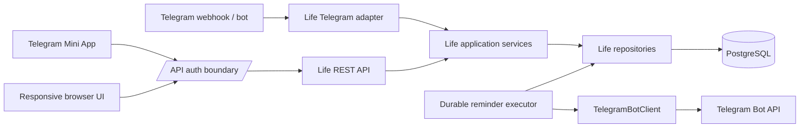
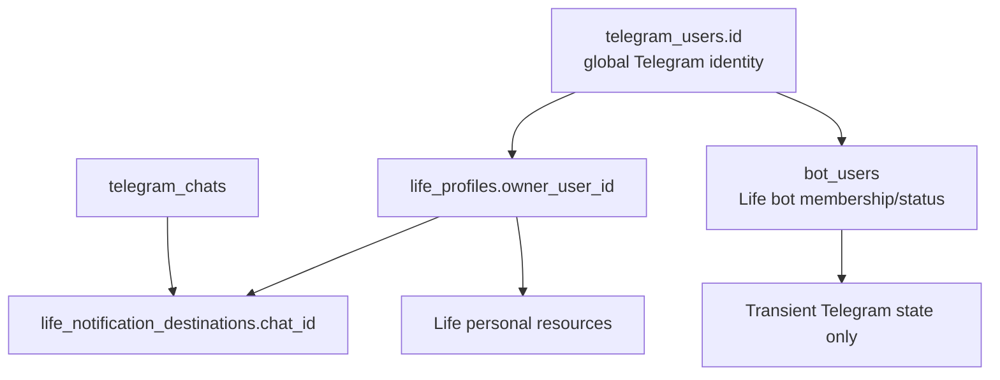
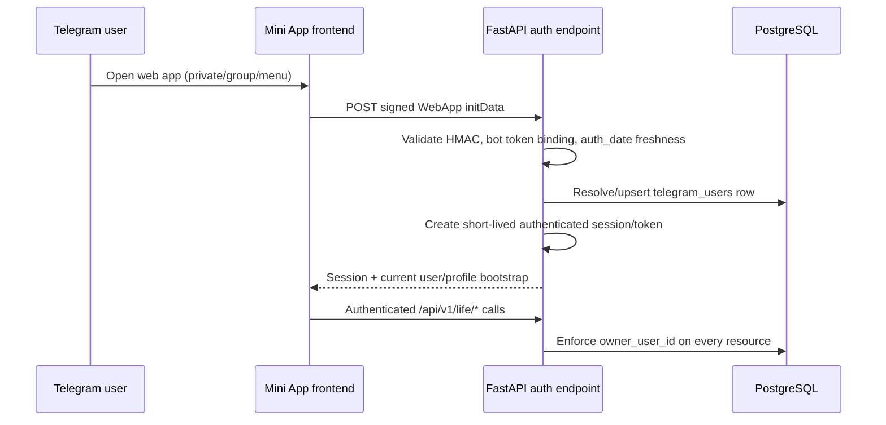

# Life Architecture Plan

## Verified current architecture

### Facts

- `app/main.py` registers `/health`, `/admin/*`, and `POST /webhook/{bot_name}`. There is no user-facing product API, API version prefix, CORS middleware, or user browser auth.
- `app/core/lifespan.py` creates one `ApplicationContainer`, discovers `app/modules/*`, loads database-configured bot instances, verifies/synchronizes webhooks, starts bot background work, and closes HTTP/database resources on shutdown.
- `app/core/registry.py` defines `BaseBot`, module factories, and runtime registries. Module packages register by name in their `__init__.py` files.
- `app/platform/users/models.py` has global `telegram_users`, global `telegram_chats`, per-bot `bot_users`, and per-bot-user JSONB conversation state. `UserContextService` upserts/returns these during webhook processing.
- `app/platform/updates/` provides database-backed `(bot_id, update_id)` idempotent claims, leases, and bounded attempts.
- `app/modules/finance/` is per `bot_user_id`; its router is Telegram-specific while `FinanceService` and `FinanceRepository` hold most invariants/persistence.
- `app/modules/islamic/` is intentionally per `(bot_id, chat_id)` and persists prayer schedules and Quran state; it has a module-local external API adapter.
- Finance and Islamic each start an `asyncio` scheduler task in `BaseBot.start()`. Both persist operational state in PostgreSQL but have no separate worker process.

## Target architecture

**PROPOSAL:** retain a modular monolith and introduce `app/modules/life/` as one registered bot module. It internally owns Planner, Nutrition, Fitness, and Grocery packages/domain boundaries. It should not become four independently registered bots or microservices.



The API must never call a Telegram router or simulate a command. Telegram adapters translate Telegram update/callback data into typed use-case requests; REST adapters validate JSON into equivalent requests. Application services own rules, transaction boundaries, ownership checks, scheduling calculations, and output values. Repositories own queries and persistence. Telegram presentation (HTML/buttons) and frontend presentation remain transports.

### Proposed Life source boundaries

```text
app/modules/life/
├── __init__.py                 # register `life` factory only
├── bot.py                      # BaseBot lifecycle + small Telegram facade
├── telegram_router.py          # /start, /app, optional /today, inline actions
├── services/                   # cross-domain Today + application use cases
├── planner/                    # reminder/routine definitions, occurrences, destinations
├── nutrition/                  # goals, foods, templates, meal logs, weight
├── fitness/                    # workout schedules and completion history
├── grocery/                    # lists, recurring items, list items
├── repositories/               # explicit session-bound queries, possibly subdomain files
├── models.py or models/        # SQLAlchemy models; choose one repository-consistent style
├── schemas.py or schemas/      # typed service/API values, not Telegram payloads
└── api.py                      # Life REST router only when user API foundation exists
```

This is a proposal, not a requirement to create every folder upfront. Start with only the boundaries a phase needs; the central rule is one Life module with internal ownership and no circular access to Finance/Islamic private tables.

## Identity and authorization architecture

**PROPOSAL:** use `telegram_users.id` as Life’s `owner_user_id`. This existing internal identity is global across configured bots, unlike `bot_users.id` which is membership within a single bot. No new application-user table is necessary while Telegram Mini App is the only end-user login.

`bot_users` remains meaningful for Life Telegram transport: it establishes the user’s membership/status/role in the Life bot and supplies transient bot state. It must not become the foreign key for canonical Life resources, because it would tie a person’s profile to a particular Life bot configuration and complicate web access.



Every Life API query receives an authenticated `owner_user_id` from the server-side session, never from a request body/path alone. Every repository query writes/filter by that owner. Notification destinations are only selected by their owning profile. For group destinations, check that the configured Life bot can legitimately send to the chat and require explicit user action/consent in UI.

## Mini App authentication architecture



**PROPOSAL:** expose a dedicated endpoint such as `POST /api/v1/auth/telegram` that accepts raw signed `initData`; validate it server-side according to the Telegram WebApp verification specification current at implementation time. Validate freshness (`auth_date`) with a configurable short window, use constant-time signature comparison, and never accept `user.id` separately as proof.

**Session proposal:** same-site, Secure, HttpOnly short-lived cookie session is the simplest Mini App/browser API interface if frontend and API share a site/origin; server-side session records in PostgreSQL are preferred initially because no Redis exists. A short-lived signed bearer access token with server-side refresh/session revocation is an acceptable alternative if frontend/API need separate origins. Choose one in Phase 1 after deployment origins are final; do not expose admin API keys or Telegram bot token to frontend.

Opening from different chats changes launch context, not `owner_user_id`. The backend may record/validate an optional launch chat only to preselect a notification destination after authorization. When opened outside Telegram, show an unauthenticated “Open in Telegram” page; independent login is deferred.

## Reminder executor architecture

See [REMINDERS.md](REMINDERS.md) for detail. The target is PostgreSQL source-of-truth schedules plus due occurrence/delivery claims. An executor polls due rows, claims with transactional locking, sends through the injected Life bot Telegram client, and records success/failure/retry. No in-memory timer is canonical.

For MVP, a FastAPI-owned executor can reuse the explicit lifecycle pattern in `app/core/lifespan.py`/`BaseBot.start()`, **but deployment must designate only one executor**. Claiming must be safe even if two start accidentally. Future deployment can run the same executor class as a dedicated process without changing data model/business rules.

## Backend/frontend responsibilities

| Concern | Backend | Frontend |
| --- | --- | --- |
| Authentication proof | Verify Telegram initData; create session | Acquire/initiate auth; never verify signatures itself |
| Rules/totals/scheduling | Canonical calculations and validation | Present results and structured forms |
| Resource ownership | Authorize via server identity | Never select owner ID |
| Notifications | Compute/claim/deliver/record | Configure destination/preferences |
| Telegram command UI | Minimal command/callback transport | Not applicable |
| Responsive UX | JSON contracts | Today/Planner/Grocery/Progress/Settings |

## Eventual repository layout

**FACT:** current root is the backend: `app/`, `migrations/`, `Dockerfile`, `docker-compose.yml`, `alembic.ini`, and `Makefile` all use root-relative paths. No frontend or CI configuration exists.

**PROPOSAL:** do not mix initial Life implementation with a broad directory move. Before frontend implementation—or before the first Life migration if the team chooses a monorepo immediately—run a dedicated preparation phase that moves backend artifacts together:

```text
project-root/
├── backend/                    # current backend root contents after deliberate move
├── frontend/                   # later, independently buildable responsive application
├── life-docs/                  # permanent, stays root-level
├── docker-compose.yml          # optional root orchestration after deliberate decision
└── README.md                   # root-level entry documentation
```

The relocation checklist must update Docker build contexts, Compose volumes/commands, Alembic paths, Makefile working directories, `.env` loading, documentation, CI if introduced, deployment scripts, and import/run commands. Git will see a large rename; isolate it in its own commit/PR and do not combine it with a schema migration. A root Compose can orchestrate backend/frontend/PostgreSQL, while each app retains its own build configuration.
