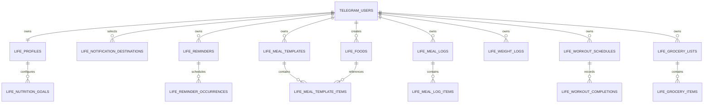

# Proposed Life Data Model

## Modeling rules

- **PROPOSAL:** canonical owner foreign keys point to existing `telegram_users.id` and are named `owner_user_id` in Life tables.
- **FACT:** PostgreSQL/SQLAlchemy async is the current persistence stack and uses `JSONB` where flexible transient data is needed. Stable, queryable Life data below is intentionally relational rather than a JSON blob.
- **PROPOSAL:** store instants as timezone-aware UTC timestamps; validate/store IANA timezone names; use local dates only where a user’s calendar day matters.
- **PROPOSAL:** table names use `life_` prefixes because current module tables use module prefixes (`finance_*`, `islamic_*`). Names are planning names, not migrations.

## Identity/settings

### `life_profiles` — MVP

Purpose: one personal Life profile/configuration per global Telegram identity.

Ownership: unique `owner_user_id → telegram_users.id`; personal, not chat/bot owned.

Major fields: `id`, `owner_user_id`, `timezone`, optional `display_name`, optional `height_cm`, optional `sex`, optional onboarding state/version, timestamps.

Constraints/indexes: `UNIQUE(owner_user_id)`; validated IANA timezone in service; index on owner is implicit through unique key.

Relationships: parent of all Life personal entities. Do not copy general Telegram profile fields already held by `telegram_users` unless user-editable Life profile semantics require it.

### `life_nutrition_goals` — MVP

Purpose: active/user-configured calorie and protein targets.

Ownership: `profile_id → life_profiles.id`.

Major fields: `id`, `profile_id`, `calorie_target_kcal`, `protein_min_g`, `protein_max_g`, `effective_from`, timestamps.

Constraints/indexes: non-negative calorie/min/max; `protein_max_g >= protein_min_g`; `UNIQUE(profile_id, effective_from)`; index `(profile_id, effective_from DESC)`.

Relationships: `life_profiles`; Today/Progress query the goal effective for a date. A history model avoids silently overwriting a target and supports later recommendation acceptance.

### `life_notification_destinations` — MVP

Purpose: selectable outbound Telegram destination, separate from ownership.

Ownership: `owner_user_id → telegram_users.id`; optional `telegram_chat_id → telegram_chats.telegram_chat_id` or a direct FK to `telegram_chats.id` chosen consistently during implementation.

Major fields: `id`, `owner_user_id`, `chat_id`, `kind` (`private`, `group`, `supergroup`), `label`, `enabled`, `is_default`, `verified_at`, `disabled_reason`, timestamps.

Constraints/indexes: unique `(owner_user_id, chat_id)`; partial unique default destination per owner if PostgreSQL migration supports it; index `(owner_user_id, enabled)`.

Relationships: referenced by reminders/routines/workouts. `chat_id` is never ownership. The bot must be able to send to the destination; failed sends can disable/mark it invalid.

## Planner

### `life_reminders` — MVP

Purpose: user-owned reminder definition, one-time or recurring.

Ownership: `owner_user_id`; optional `destination_id` owned by the same user.

Major fields: `id`, `owner_user_id`, `title`, optional `notes`, `kind` (`reminder`, `routine`, `meal`, `workout`), `schedule_type` (`one_time`, `recurring`), `scheduled_at` for one-time, `timezone`, `recurrence_rule` for recurring, `enabled`, `next_run_at`, `last_run_at`, `destination_id`, timestamps.

Constraints/indexes: title length/nonblank; one-time requires `scheduled_at` and no recurrence; recurring requires recurrence and no one-time instant; index `(enabled, next_run_at)` for executor; index `(owner_user_id, enabled, next_run_at)` for Planner/Today; FK ownership consistency checked in service or a composite strategy.

Relationships: creates occurrence/delivery rows; may be associated to a workout schedule or meal schedule later. Recurrence representation is constrained in [REMINDERS.md](REMINDERS.md), not arbitrary user-supplied cron.

### `life_reminder_occurrences` — MVP

Purpose: immutable/sufficiently auditable scheduled occurrences and delivery state. This makes retry, missed status, inline actions, and history observable without mutating the definition as the only record.

Ownership: derives from `reminder_id`; denormalized `owner_user_id` may be added for efficient ownership queries only if kept consistent.

Major fields: `id`, `reminder_id`, `scheduled_for`, `status` (`pending`, `claimed`, `sent`, `failed`, `missed`, `completed`, `skipped`), `claimed_at`, `claim_token`/lease expiry, `attempts`, `delivered_at`, `completed_at`, `failure_code`, `failure_detail` (safe/redacted), optional Telegram message ID, timestamps.

Constraints/indexes: `UNIQUE(reminder_id, scheduled_for)`; index `(status, scheduled_for)` and/or `(status, lease_expires_at)`; bounded attempts.

Relationships: one reminder has many occurrences; completion history feeds Today/Progress. The executor claims these rows rather than treating `next_run_at` alone as delivery state.

### `life_routine_completions` — MVP only if routine completion needs richer state than occurrences

Purpose: explicit daily completion/skip record for routines that may not map 1:1 to a notification.

Ownership: owner through reminder/routine; could be represented by `life_reminder_occurrences` for the MVP to avoid duplicate models.

Proposal: **defer separate table initially**; use `kind='routine'` reminders plus occurrence status. Introduce only if multiple completions/day, flexible daily targets, or non-notifying routines are required.

## Nutrition

### `life_foods` — MVP

Purpose: user-created food definitions; no global food database.

Ownership: `owner_user_id`.

Major fields: `id`, `owner_user_id`, `name`, `serving_label`, `serving_grams` nullable, `calories_kcal`, `protein_g`, `active`, timestamps.

Constraints/indexes: nonblank name; non-negative nutrition values; index `(owner_user_id, active, name)`; optional case-insensitive uniqueness policy is an open implementation detail.

Relationships: meal-template items and meal-log items reference foods but snapshot values when logged.

### `life_meal_templates` and `life_meal_template_items` — MVP

Purpose: user-configured named reusable meal composition.

Ownership: template `owner_user_id`; item belongs to template.

Major fields: template `id`, owner, `name`, optional meal slot/notes, active/timestamps. Item `id`, `template_id`, `food_id`, `quantity`, ordering, optional overridden serving/macros.

Constraints/indexes: unique template name per owner if desired; `quantity > 0`; index owner/template and template/item position.

Relationships: a template has ordered food items; meal logs may be created from template but must snapshot the values used at logging time.

### `life_meal_logs` and `life_meal_log_items` — MVP

Purpose: daily consumed/planned meal records and item-level calorie/protein totals.

Ownership: `owner_user_id`; one `logged_on` local date/time context.

Major fields: log `id`, owner, optional template ID, `meal_slot`, `occurred_at`, `local_date`, status (`planned`, `logged`, `skipped`), note/timestamps. Item `id`, log ID, optional food ID, `food_name_snapshot`, quantity, `calories_kcal_snapshot`, `protein_g_snapshot`.

Constraints/indexes: non-negative values; item quantity positive; indexes `(owner_user_id, local_date)` and `(meal_log_id)`.

Relationships: Today totals calculate only `logged` items. Snapshots preserve history when a user later edits/deactivates a food/template.

### `life_weight_logs` — MVP

Purpose: dated body-weight history.

Ownership: `owner_user_id`.

Major fields: `id`, owner, `weighed_at`, `local_date`, `weight_kg`, optional note, timestamps.

Constraints/indexes: positive plausible range validated in service; `UNIQUE(owner_user_id, local_date)` for MVP one daily log (or permit multiple times and select daily latest—open product choice); index `(owner_user_id, local_date DESC)`.

Relationships: Progress; future deterministic weight trend recommendation. No autonomous goal updates.

## Fitness

### `life_workout_schedules` — MVP

Purpose: user-owned workout plan/schedule, optionally notification backed.

Ownership: `owner_user_id`.

Major fields: `id`, owner, `name`, optional `workout_type`, `enabled`, optional `reminder_id` or embedded constrained schedule fields, timestamps.

Constraints/indexes: nonblank name; index owner/enabled. **Proposal:** reference a `life_reminders` row rather than duplicate recurrence/next-run logic; establish with a clear one-to-one optional FK.

Relationships: workout completions; associated reminder.

### `life_workout_completions` — MVP

Purpose: done/skipped completion history for workouts.

Ownership: derives from `workout_schedule_id`, with denormalized owner only if needed.

Major fields: `id`, schedule, `scheduled_for`/`local_date`, `status` (`done`, `skipped`), `completed_at`, optional note, timestamps.

Constraints/indexes: `UNIQUE(workout_schedule_id, scheduled_for)` if one completion each occurrence; index by schedule/local date.

Relationships: feeds Today and Progress. It may be synchronized from a reminder occurrence, but preserve an explicit domain record if statuses/notes must evolve independently.

## Grocery

### `life_grocery_lists` — MVP

Purpose: a user’s planned shopping list, normally associated with a week/date range.

Ownership: `owner_user_id`.

Major fields: `id`, owner, `name`, `starts_on`, `ends_on`, `status` (`active`, `archived`), timestamps.

Constraints/indexes: `ends_on >= starts_on`; index `(owner_user_id, status, starts_on DESC)`; no requirement that only one active list exists unless product confirms it.

### `life_grocery_items` — MVP

Purpose: editable, buyable item in a list.

Ownership: via list.

Major fields: `id`, list ID, `name`, `quantity`, `unit`, optional `estimated_unit_price`, `is_bought`, `bought_at`, ordering/timestamps.

Constraints/indexes: nonblank name; quantity positive; price non-negative; index `(list_id, is_bought, position)`.

Relationships: simple estimated spending is derived from current items. No inventory relationship in MVP.

### `life_recurring_grocery_items` — MVP

Purpose: reusable item templates that can seed a new list.

Ownership: `owner_user_id`.

Major fields: `id`, owner, name, default quantity/unit/estimate, enabled, optional recurrence cadence, timestamps.

Constraints/indexes: same basic item validations; `(owner_user_id, enabled)` index. **Proposal:** begin as manually selected/default recurring items; defer automatic scheduled list generation unless Planner requirements require it.

## Deferred entities

- Inventory/ingredients and depletion ledger.
- Nutrition global catalogue/API cache.
- Goal-recommendation table (add only with post-MVP weight trend feature; it would store suggestion input/version/status and explicit apply/ignore action).
- Application-user/account identity abstraction for independent login.
- Audit/event stream beyond occurrence/completion histories.

## Relationship summary

