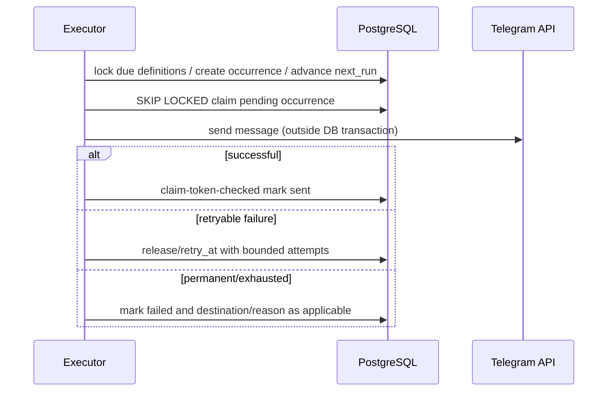

# Life Reminder Architecture

## Goal

**CONFIRMED REQUIREMENT:** support durable one-time and recurring reminders with timezone awareness, enablement, next occurrence, Telegram destinations, failure/retry semantics, restart durability, and safe multiple-process behavior.

**PROPOSAL:** model reminder definitions and occurrence/delivery state separately. PostgreSQL is the source of truth. The executor is replaceable; an in-memory task is never the canonical schedule.

## What exists today

### Finance pattern — facts

`FinanceAlertScheduler` in `app/modules/finance/services.py` starts an `asyncio.Task` from `FinanceBot.start()`, ticks every 30 seconds, calls `FinanceService.claim_due_alerts()`, sends via `FinanceBot.deliver_alert()`, and calls complete/release. `finance_profiles` persists alert time/timezone/chat, last alert, and claim fields. Service methods use transactions and locks.

### Islamic pattern — facts

`IslamicScheduler` uses the same lifecycle/tick model. `islamic_prayer_schedules` stores due timestamps/statuses/claim fields. `IslamicRepository.due_prayers()` locks due rows with `FOR UPDATE SKIP LOCKED`; delivery is completed/released in service. Quran session expiry and calendar synchronization run in the same loop.

### Recommendation from comparison

Reuse: PostgreSQL state, transaction boundaries, due-row claims, `SKIP LOCKED`, a claim→send→complete/release lifecycle, UTC timestamps, and bot lifecycle integration.

Do not generalize: Finance’s profile-specific daily-alert fields; Islamic’s three hardcoded prayer status columns/windows; either module’s direct “one task per module” assumption as a generic multi-instance scheduling topology.

## Data/state model

See `DATA_MODEL.md` for `life_reminders` and `life_reminder_occurrences`.

### Definitions

- A **reminder definition** says what/when/where: owner, title, schedule type, timezone, recurrence/instant, enabled, next run, destination.
- An **occurrence** is one scheduled instant and its delivery/completion state. Its unique `(reminder_id, scheduled_for)` constraint prevents duplicate creation.
- An optional **delivery attempt** table is deferred for MVP. Store bounded attempt count/error code on occurrence first; add child attempt records only when operational audit requirements justify it.

### Recurrence representation

**PROPOSAL:** support a constrained structured recurrence, not free-form cron and not an arbitrary RRULE string in MVP:

```json
{ "frequency": "daily", "interval": 1, "time": "08:00" }
{ "frequency": "weekly", "interval": 1, "weekdays": ["mon", "wed", "fri"], "time": "18:00" }
```

Persist the validated canonical JSON only if database modeling a separate recurrence table does not add query value; it is acceptable JSON because recurrence is one bounded configuration object, not a collection of primary business records. Validate against a strict Pydantic schema. Add monthly/complex recurrence only when product requires it. This avoids an infrastructure dependency and ambiguous cron behavior.

### Timezone and DST

- Store user/reminder timezone as IANA name; validate with `zoneinfo.ZoneInfo`, matching current Finance/Islamic approach.
- Store `scheduled_for`, `next_run_at`, claims, delivery, and completion in UTC.
- Compute recurrence in the reminder’s local wall time, then convert to UTC.
- **PROPOSAL:** for nonexistent DST local time, run at the first valid instant after the gap; for ambiguous repeated local time, run once at the earlier offset. Persist occurrence UTC instant so it cannot run twice. Document this in UI/help.
- Changing timezone/recur rule recomputes future `next_run_at`/unclaimed occurrences in a transaction; it must not rewrite past history.

## Executor algorithm

### Generation and claiming

At each tick (initially 15–30 seconds; make configurable):

1. In a short transaction, lock a bounded batch of enabled definitions due at or before `now` with `FOR UPDATE SKIP LOCKED`.
2. For each definition, insert its due occurrence with `ON CONFLICT DO NOTHING` and advance `next_run_at` deterministically to the next local occurrence. Generate at least the due occurrence; do not pre-generate unbounded future rows.
3. Select due pending/retryable occurrences in a bounded batch, also `FOR UPDATE SKIP LOCKED`.
4. Atomically mark each `claimed`, set random claim token/lease expiry and increment attempt count; commit.
5. Outside the transaction, send using the configured Life bot `TelegramBotClient`.
6. In a new transaction, verify claim token, then mark `sent` or schedule retry/release claim. Do not hold PostgreSQL locks across network calls.



### One-time versus recurring

- **One-time:** one definition/one occurrence. On successful send, disable/complete definition. If late beyond grace it becomes `missed`; no retroactive notification.
- **Recurring:** advance schedule by recurrence rule based on the last planned local occurrence, not merely “now + interval,” avoiding drift. On downtime, do not emit all old occurrences; mark/skip stale planned instants and create/retain the next future occurrence.
- Enable/disable updates definition. Disabled pending occurrences should be skipped/cancelled according to explicit service rule, never accidentally delivered from a stale claim.

## Retry, failure, and missed semantics

**PROPOSAL:** classify Telegram failures from existing `TelegramAPIError`/HTTP detail into retryable (timeout/network/429/5xx) and permanent (invalid chat, blocked bot, malformed request). Use bounded attempts with exponential backoff and jitter, respecting Telegram retry-after where safely available.

- A claim lease prevents a crashed worker from permanently holding work. On lease expiry, a new executor can reclaim if attempts remain.
- A permanent invalid/bot-blocked destination marks that destination disabled with safe reason and marks occurrence failed; it does not delete the person’s reminder.
- A retryable exhausted occurrence becomes failed and is visible in Planner/Today/history.
- **Proposed missed policy:** a one-time item may send once if within configured grace; otherwise `missed`. Recurrences do not bulk catch up. User must confirm grace duration/product UI.
- Outgoing Telegram delivery is inherently at-least-once in the narrow window after Telegram accepts send but before local success commit. Store Telegram message ID when returned and use claim tokens/unique occurrence; document possible rare duplicate delivery, as current README does for webhook replies.

## Restart and multi-process behavior

### MVP single-process / single executor

An executor can initially be started from `LifeBot.start()` or a narrowly scoped application lifecycle service. This is compatible with existing design but must be feature-flagged/configured so exactly one process is the intended executor. Startup resumes from DB state; no schedule is lost because only task runtime is in memory.

### Multi-worker/replica future

The schema/algorithm permits multiple executors: `SKIP LOCKED`, unique occurrence constraint, claim token/lease, and token-checked completion make work distribution safe. Still, run an executor explicitly rather than accidentally once per web worker. Recommended migration:

1. Extract executor construction from `LifeBot` into a reusable `LifeReminderExecutor` class with no FastAPI request dependency.
2. Add an executable worker entrypoint/container using same settings/database/module composition or a focused delivery composition root.
3. Scale API replicas without scheduler flag; run one worker replica initially, then scale workers only with metrics/operational controls.
4. Add monitoring for overdue occurrences, claim age, failure rate, executor heartbeat, and destination failures.

No Celery/Redis/APScheduler is required by this path. Introduce a broker only when scheduled work volume, latency, independent retry policies, or operational isolation demonstrate PostgreSQL polling is insufficient.

## Notification destinations and inline actions

Destination is a persisted owner-authorized record, not a chat ID supplied at send time. Default initially to the user’s private chat captured through verified bot interaction/Mini App context. Group destinations are optional and explicitly opt-in.

Inline completion callback data must contain an opaque occurrence/action identifier, not trusted owner data. On webhook callback, resolve normal Telegram `UserContext`, verify occurrence ownership, then make an idempotent transition. This is required because a group notification can be clicked by someone other than its owner.

## Operational limits and observability

- Bounded claim batches and network concurrency.
- Index every due/lease query (`status`, `scheduled_for`, `lease_expires_at`) and owner Planner query.
- Structured logs include occurrence/reminder/destination IDs but no message content or secrets.
- Health should eventually expose executor state/lag separately from generic bot health.
- A manual “recompute/retry” administrative path is deferred; no admin endpoint is planned in MVP without operational requirement.
